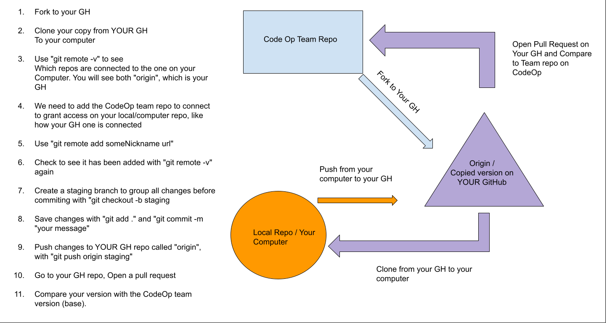
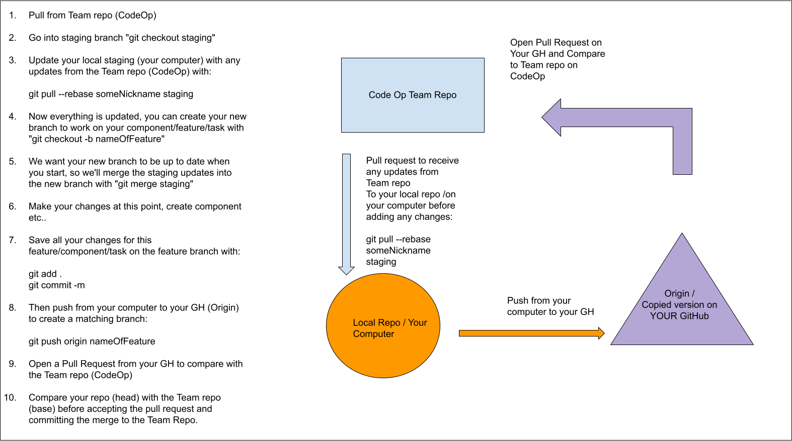
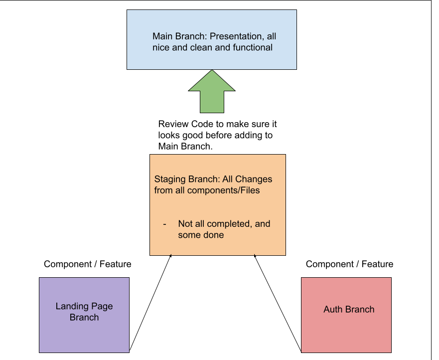

# FSD-groupMVP-sharing-repo
Learning how to use a shared repo

# How to use a shared repo for a group project

1. [Forking and Setting up from a Master Repo](#fork)
2. [Create a Staging Branch](#create-staging)
3. [Create a New Branch for a New Feature/Task/Component](#create-branch)
4. [Pushing Code](#push-code)


## <a name="fork">Forking and Setting up from a Master Repo</a>



On the Team repo in GitHub, on the top right corner underneath your profile, is a "Y" branching icon called "Fork". Click on this button. It creates an identical copy from the Team repo into your GitHub. 

 On your forked version on GitHub, copy the URL link from the green button that says "Code" 

- Open your code editor, ex: VSCode and clone it on your terminal/Git BASH. Then clone the repo to create the project onto your local machine/computer.
    
>       git clone https://github.com/yourUsername/CopiedRepoName.git


 In your terminal, change directories so that you are now in the project folder of the repo you just cloned from your GitHub:

>       cd CopiedRepoName

Check to see what repos are connected to the one you just cloned to your computer:

 >      git remote
 >      origin
 
 This will output and display the nicknames of remote repos (from GitHub) attached to your local computer repo. Origin is the default nickname for the copy on your GitHub. 
 
 Or 
 
>       git remote -v
>       origin  git@github.com:origin_user/reponame.git (fetch)
>       origin  git@github.com:origin_user/reponame.git (push)

The output will display the same information as the previous, but with additional information such as the URL paths for the remote (GitHub) repos. 

Now we want to also add a connection to the original Team repo that you forked from. Go to the original Team repo, and copy the url from the green "Code" button. 

Next, we will manually connect the Team repo to your local repo (on your computer). We can do this using the "git remote add" command:

>       git remote add nickNameForTeamRepo url

ex:

>       git remote add team-repo git@github.com:team-repo_user/reponame.git 

Now we can check to make sure the team repo was added:

>      git remote -v
>
>      origin  git@github.com:origin_user/reponame.git (fetch)
>      origin  git@github.com:origin_user/reponame.git (push)
>      team-repo  git@github.com:team-repo_user/reponame.git (fetch)
>      team-repo  git@github.com:team-repo_user/reponame.git (push)

## <a name="create-staging">Create a Staging Branch</a>

 Now that you have your forked version of the repo cloned to your local machine/computer, create a staging branch to temporarily hold all your changes:
 
>      git checkout -b "staging"  

Save these changes:

>      git add .

Check to see if changes have been added, then commit:

>      git status
>      git commit -m "created staging branch"

Then commit the changes to your remote repot (GitHub), this will create a new branch that is identical to the branch you just created:

>      git push origin staging

Open your GitHub and create a Pull Request, it might have already automatically created. You'll see a pop up in your GitHub with a green button that says "Compare & Pull Request". Click on it to check everything looks ok. Then confirm the merge. It will add it to your main branch on your GitHub.

## <a name="create-branch">Create a New Branch for a New Feature/Task/Component</a>


Before you create a new branch, make sure your repo is up to date if there were any updates in the team repo:

>      git checkout staging 
>      git pull --rebase nickNameForTeamRepo staging

Now that your staging branch on your local repo (your computer) is all updated, this prevents any unnecessary merge conflicts later. To add another new branch on your local repo (on your computer) use the git command "git checkout -b":

>       git checkout -b "Feature-One"

 Press Enter, the output display will say something similar to:

>       Switched to a new branch 'Feature-One'

Next, you will need to update your new "Feautre-One" branch by receiving the code from staging via merge, so you can start working with the most current code:

>       git merge staging


 Now you are ready to start working on your Component/Feature/Task. Remember to stage all changes as you keep working, to prevent losing any work. 

*Refresher*
*  Staging => when you add a specific file(s) you are working on, and you would like to use but not sure if you would like to add these changes to your repo  history (commit). You would then use the command "git add" 

>       git add README.md

OR

>       git add .
>       

 What is the difference between:

>       git add .

 And 

>       git add README.md

 If you are only working on a specific file, you can just indicate the file. If you are fixing something that inlcudes or affects all the files, you would probably like to use "git add ." to indicate all files to cover your bases in case you forget which files were modified. If you are not sure if you already staged your changes, you can use the command "git status" to check if you need to stage these changes. 
 
>       git status
>       On branch Feature-One
>       Changes not staged for commit:
>         (use "git add <file>..." to update what will be committed)
>         (use "git checkout -- <file>..." to discard changes in working directory)
>
```diff

-  modified:    README.md

```
>
>       no changes added to commit (use "git add" and/or "git commit -a")


 After making your changes, or when you are done with your branch and staged/added your changes, you can check to see if everything is ready to commit:
  
>       git add README.md
>       git status
>       
>       On branch Feature-One
>       Changes to be committed:
>         (use "git reset HEAD <file>..."to unstage)
>
```diff

+  modified:    README.md

```
>
  
- If you want to "undo" to a commit at any point, you can use the "git reset HEAD nameOfFile". 

Now that you are happy with all the changes and have staged them all, you're ready to commit them to your local repo (on your Computer):
  
>       git commit -m "created readme"
  
  
  ## <a name="push-code">Pushing Code</a>
 
 
 
 Always pull to make sure your all branches are up to date before pushing your commits. This prevents unnecessary mere conflicts. Synchronize your feature branch before pushing. Using "git pull" is the same as ["git fetch" and "git merge"](https://www.atlassian.com/git/tutorials/syncing/git-pull). It will update your local repo on your computer with the current code from your remote repo (GitHub):
 
>       git pull --rebase nickNameForTeamRepo staging
 
If there are any conflicts, resolve the changes. If you do not have any merge conflicts, you can [skip to here.](#no-conflicts)
 
- *Tip: "Current Head"  means the current changes in the REMOTE GitHub repo, NOT your local computer.* 
 
- *"Incoming Changes" is the one that you have been working on.* 

Once you have resolved your changes in your branch, save and commit again with "git add ." and "git commit -m yourMessage"
 
 ### <a name="no-conflicts">If you have no merge conflicts</a>, you can go ahead and push your "Feature-One" branch to your GitHub repo:
 
 >      git push origin Feature-One"
 
 - This will create an identical branch on your GitHub called "Feature-One", since there was none originally.
 
 Next, you'll do a pull request, it will probably pop up automatically once you head to your GitHub. It will ask you to "Compare & Pull Request". Compare the code between your repo and the original Team repo before confirming to merge it. 
 
 
